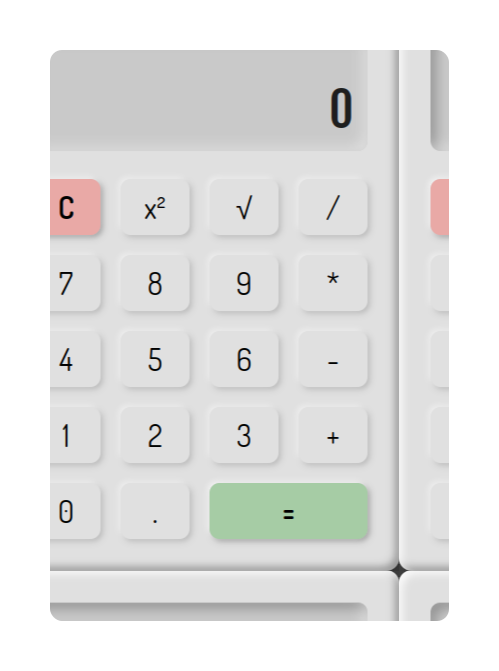

# Etch-A-Sketch

### Live Preview: &nbsp;[odi000.github.io/Calculator](https://odi000.github.io/Calculator/)

This project was created for the [Calculator assignment](https://www.theodinproject.com/lessons/foundations-calculator) as part of [The Odin Project](https://www.theodinproject.com/dashboard) curriculum.

### Provided Asets

* None

### Objectives

1. Make a calculator without using `eval()` and `new Function()` due to potential pitfalls  of evaluating insecure data.
2. Build your own functions to evaluate expressions as part of this calculator project.
3. Must contain basic math operations add, subtract, multiply & divide.
4. It should not evaluate more than a single pair of numbers at a time.

### More Features

* X Squared
* Square Root 
* Neumorphic design